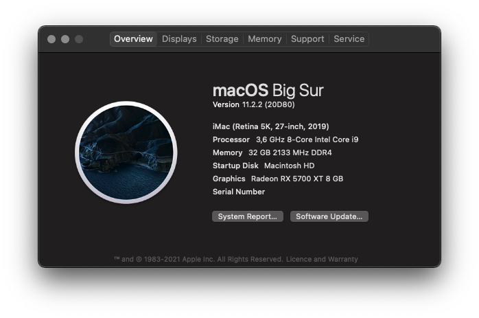

# Hardware

| Component | Product |
| --------- | ------- |
| CPU |     Intel Core i9-9900K 3.6 GHz 8-Core |
| Motherboard |     Gigabyte Z390 I AORUS PRO WIFI Mini ITX | 
| RAM |     Corsair Vengeance RGB Pro 32 GB (2 x 16 GB) DDR4-3200 CL16 |
| SSD |     Samsung 960 EVO 500 GB M.2-2280 NVME |
| GPU |     Sapphire Radeon RX 5700 XT 8 GB NITRO+ |

[The full hardware list at pcpartpicker.com](https://pcpartpicker.com/user/kirillrepkin/saved/n4hKXL)

# Software

| Component | Product | Version |
| --------- | ------- | ------- |
| Bootloader | OpenCore | 0.6.6 |
| OS | MacOS | Big Sur  11.2.2 (20D80) |
| OS | ArchLinux | - |
| OS | Windows 10 | - |

### About This Mac

